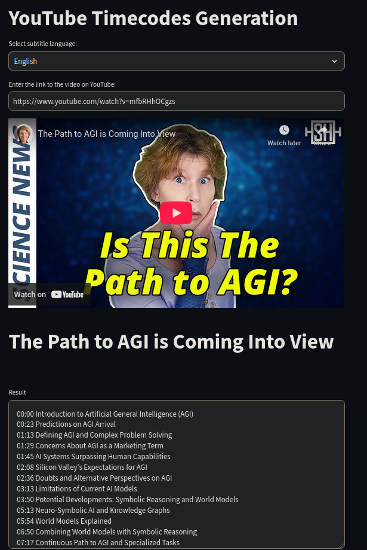

# YouTube AI Timecodes Generator  🕒

This repository offers an AI-driven tool designed to automatically create timecodes for YouTube videos. Whether you're a video creator, editor, or simply someone who enjoys structuring information, this project is intended to streamline the task of adding timestamps to your content using power of AI. And it's completely free!

## Features 🚀

- AI-powered timecode generation
- Python3 language support
- Integration with the YouTube API
- Streamlit interface for easy use
- Completely free for everyone

## Install

**The app was tested on the following configuration:**

- OS:
  - Ubuntu 22.04
- Python:
  - 3.11.9(64b)
- LLM (AI):
  - Gemini-2.0-Flash

**Download and install Python:**

   - [How to Install Python on Windows](https://www.geeksforgeeks.org/how-to-install-python-on-windows/)
   - [How to Install Python on Linux](https://www.geeksforgeeks.org/how-to-install-python-on-linux/)
   - [How to Download and Install Python on macOS](https://www.geeksforgeeks.org/how-to-download-and-install-python-latest-version-on-macos-mac-os-x/)

**Activate the virtual environment**

   ```bash
   python -m venv virtual
   ```
   or

   ```bash
   python3 -m venv virtual
   ```

   Then activate virtual environment:

   ```bash
   source virtual/bin/activate
   ```

   For Windows, you need to open the terminal (Win + R -> type cmd in the window that appears, then Enter):

   ```bash
   .\virtual\Scripts\activate
   ```

   If Windows reports that python is not recognized as an executable command, etc., run the python installer again, in the window that appears click Modify -> Next -> Add python to environment variables.


**Install requirements:**
```bash
pip install -r requirements.txt
```
**Get API key**

Go to [Google AI studio](https://aistudio.google.com), register there if you aren't and push the button *Get API key* in the upper left corner.
Then follow the instructions.


**Set .env file:**

Create .env file in the project directory:
```bash
touch .env
```
Enter your LLM API key in the .env file
```
LLM_API_KEY="YOUR_LLM_API_KEY"
```

**Set config file:**

If you want to change the model or its temperature settings, you can do it in `src/app_config.py`:
```python
# name of your preferred model
MODEL_NAME = "gemini-2.5-flash" 
# model temperature (0.0 to 2.0) - increasing of temperature value increases model creativity
# but also makes it more prone to mistakes and hallucinations
TEMPERATURE = 0.4 
```

# Service launch

1. Run command in bash
```bash
streamlit run app.py
```
If you run this service after logout or reboot, don't forget to activate virtual environment.

```bash
source virtual/bin/activate
```

2. Browser window will be opened. 

3. Choose subtitles language and enter link to the YouTube.

4. Press *Generate timecodes* button

5. Enjoy the result :)



# FAQ

**Q**: Is this service free? Do I have to pay for LLM API?

**A**: Yes, it's free. No, you don't have to pay for LLM API. Google has free tier for its API access. The free tier is limited to 15 requests per minute and this limit is more than enough for personal usage of this service.

**Q**: Is the quality of timecodes generation good enough?

**A**: I think it is good, but if you aren't pleased by some of timecodes you can change them after generation as you want. Or you can run multiple generations and select the best result.

**O**: I enter the link to YouTube video, but nothing happens.

**A**: Maybe your YouTube link is incorrect of has timecodes at its end. Check if the video link ends with something like *&t=1s*, delete it and try again.
